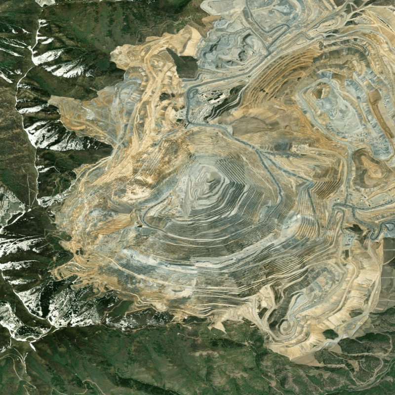
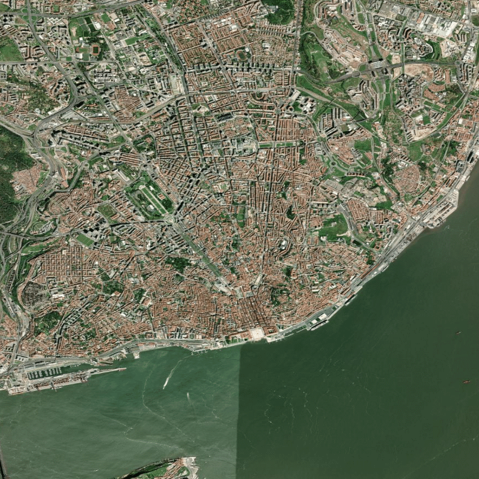
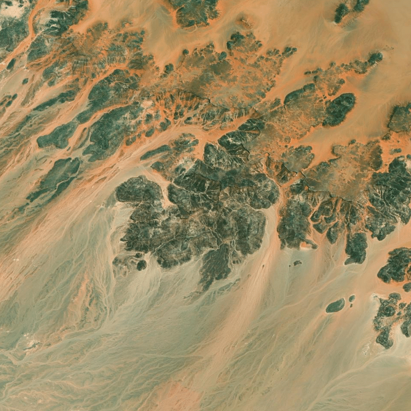
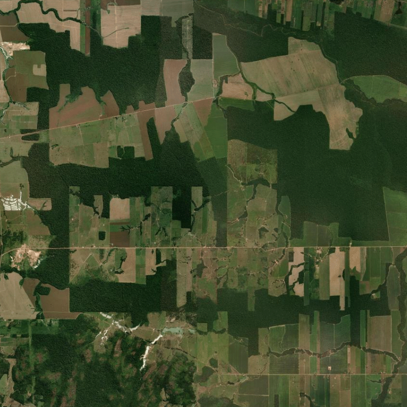
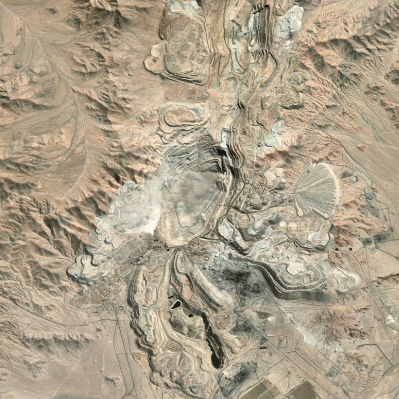

# Environmental Data Explorer & AI Environmental Risk Assessment - Group_L

Advanced Programming for Data Science - Group Project

## Authors
- Artur Bastos — [52011] — [52011@novasbe.pt]
- Beatriz Boal — [56556] — [56556@novasbe.pt]
- Lucrezia Salerno — [70098] — [70098@novasbe.pt]
- Rita Borges Coelho — [75754] — [75754@novasbe.pt]

---

## Project Structure
   ```bash
   Group_L/
   ├── app/
   │   ├── __init__.py
   │   ├── environmental_data.py
   │   ├── ai_pipeline.py
   │   ├── image_utils.py
   │   └── storage.py
   ├── pages/
   │   └── Environmental_Risk_Analyzer.py
   ├── database/
   │   └── images.csv
   ├── images/
   ├── tests/
   ├── models.yaml
   ├── main.py
   ├── requirements.txt
   └── README.md
```

---

## Installation

1. **Clone the repository**  
   ```bash
   git clone https://github.com/LucreziaSalerno/Group_L.git
   cd Group_L

2. **Install the dependencies**
   ```bash
   pip install -r requirements.txt

3. **Ollama Setup**

   This project uses **Ollama** to run local AI models for image analysis.

   Install Ollama from: https://ollama.com

   Then download the models used in this project:
   ```bash
   ollama pull llava
   ollama pull llama3.2:3b
   ```

4. **Run the application**
   ```bash
   streamlit run main.py

The application will open in your browser and contains two pages:
- **Environmental Data Explorer**
- **Environmental Risk Analyzer**

---

## About the App

**Environmental Data Explorer** is an interactive dashboard built with [Streamlit](https://streamlit.io) that visualises key environmental indicators from [Our World in Data](https://ourworldindata.org). It allows users to explore global trends in forest change, deforestation, protected land, degraded land, and the Red List Index – all with the most recent data available.

**Environmental Risk Analyzer** analyzes satellite imagery to detect potential environmental risks.

## Features

### Environmental Data Explorer

- **Automatic data download** – On first run, the app fetches the latest CSV datasets and a high‑resolution world map from Natural Earth. Everything is stored locally.
- **Interactive choropleth map** – Choose a dataset and a year; the map colours countries according to their value, with hover details.
- **Top / bottom countries** – A bar chart automatically displays the five countries with the highest and the five with the lowest values for the selected indicator.

### Environmental Risk Analyzer

- **Interactive coordinate selection** - Users can manually enter coordinates, choose preset locations, or click directly on a map.
- **Satellite image download** - The app retrieves satellite imagery from **ESRI World Imagery**.
- **AI image description** - The LLaVA model describes the satellite image by identifying visible landscape features..
- **Environmental risk classification** – A second AI model (Llama 3.2) evaluates whether the area may be environmentally at risk.
- **Result caching** - Previously analyzed coordinates are stored in [Images database](database/images.csv) to avoid recomputation.
- **Results Dashboard** - The app presents:
   - risk classification
   - confidence indicator
   - coordinates and zoom level
   - AI-generated explanation

---

## How it Works

The app uses a custom `EnvironmentalData` class (in `app/environmental_data.py`) to handle downloading, caching, and merging the spatial data with the statistical tables. All visualisations are created with [Plotly Express](https://plotly.com/python/plotly-express/), ensuring smooth interactivity.

For the Environmental Risk Analyzer, additional modules in the `app/` folder manage the analysis pipeline:

- **image_utils.py**  
  Handles downloading satellite images from ESRI World Imagery.

- **ai_pipeline.py**  
  Communicates with local Ollama models to generate image descriptions and environmental risk assessments.

- **storage.py**  
  Saves results to `database/images.csv` and checks whether the same coordinates have already been analyzed.

The AI models and prompts are configured in **models.yaml**, allowing the workflow to be adjusted without modifying the code.

---

## Contribution to the UN Sustainable Development Goals (SDGs)

Artificial intelligence and satellite imagery analysis can play an important role in supporting environmental monitoring and sustainability initiatives. By automatically analyzing satellite images and identifying potential environmental risks, the system could help detect land disturbances such as mining activity, large-scale excavation, or other environmental changes. 

This type of automated analysis could support better-informed decision making and help protect ecosystems, urban environments, and natural resources. It could assist environmental agencies, NGOs, and researchers by offering a faster way to screen large geographic areas and identify locations that may require further investigation. While the system does not replace expert environmental analysis, it can serve as an initial screening tool that helps prioritize where detailed environmental assessments should be conducted. 

Through these capabilities, the project contributes to broader sustainability efforts by supporting environmental monitoring and responsible management of natural resources, which are central objectives of several UN Sustainable Development Goals.

---

## SDGs Associated with This Project

**SDG 13 – Climate Action**

This app can make it easier to observe changes in landscapes over time and support broader efforts to understand how human activities affect the environment. Access to this type of information can help track environmental changes and contribute to a better understanding of climate-related impacts on different regions.

**SDG 15 – Life on Land**

The project contributes to this objective by identifying visible disturbances to natural landscapes, such as mining activity or large-scale excavation. Detecting these types of land alterations can help draw attention to potential ecosystem disruption and support efforts to monitor land use and environmental impact on biodiversity.

**SDG 11 – Sustainable Cities and Communities**

The app can analyze satellite images of urban areas and distinguish between normal infrastructure and potential environmental risks. This type of monitoring can support sustainable urban development by highlighting locations that may require closer environmental assessment.

**SDG 6 – Clean Water and Sanitation**

Although the app does not directly measure water quality, environmental disturbances such as mining or large-scale land excavation can affect nearby water systems. Satellite-based monitoring tools can therefore help identify locations where human activity may pose potential risks to natural resources, including water.

---

## Example Results

### Mining Area - Risk Detected (Y)

Latitude: 40.5230
Longitude: -112.1510
Zoom: 13



The model identifies visible signs of large-scale mining activity, including exposed soil and excavation structures.

Risk Assessment: **Potential environmental risk detected**

---

### Lisbon Urban Area - No risk detected (N)

Latitude: 38.7223  
Longitude: -9.1393  
Zoom: 12  



The satellite image shows dense urban infrastructure without visible environmental damage.

Risk assessment: **No clear environmental risk detected**

---

### Sahara Desert - No risk detected (N)

Latitude: 23.4162  
Longitude: 25.6628  
Zoom: 11  



The model correctly recognizes the landscape as a natural desert environment with sparse vegetation.

Risk assessment: **No clear environmental risk detected**

---

### Rondonia Deforestation - Risk Detected (Y)

Latitude: -9.6000  
Longitude: -63.0000  
Zoom: 11  



The satellite image reveals widespread deforestation with clear-cut areas and fragmented forest cover, indicating major land degradation and active habitat loss.

Risk assessment: **Potential environmental risk detected**

---

### Chuquicamata Copper Mine - Risk Detected (Y)

Latitude: -22.2885  
Longitude: -68.9000  
Zoom: 12  



The model detects a massive open-pit mining operation with extensive areas of bare soil, tailings, and severe land degradation.

Risk assessment: **Potential environmental risk detected**

---
